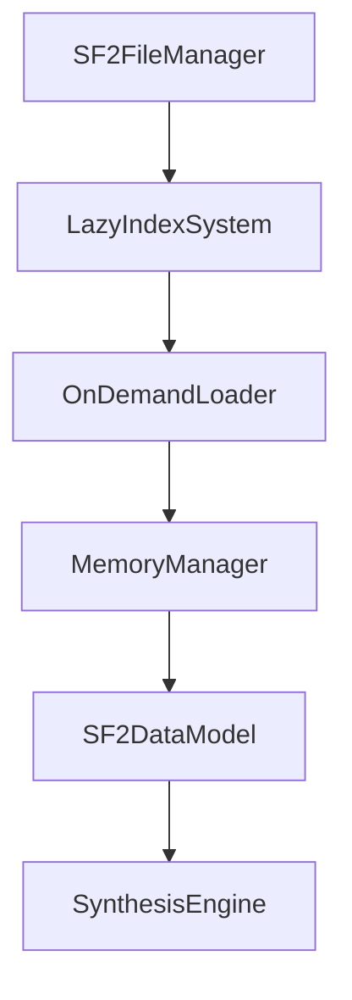

# SF2 Complete Redesign Plan

## Overview
Complete redesign of the `LazySF2SoundFont` and related classes from scratch, with no backward compatibility constraints. This allows for a clean, efficient, and production-quality implementation that fully leverages lazy loading and modern design principles.

## Key Design Principles
1. **True Lazy Loading**: Load data only when explicitly needed.
2. **Memory Efficiency**: Minimal initial memory footprint.
3. **High Performance**: Optimized for real-time synthesis with low latency.
4. **Scalability**: Handle 1GB+ soundfonts with thousands of presets and zones.
5. **Comprehensive SF2 Support**: Full support for all SF2 features including generators, modulators, and multi-layered presets.

## Architecture Overview

### Core Components
1. **SF2FileManager**: Central manager for SF2 file operations.
2. **LazyIndexSystem**: Offset-based indexing without data loading.
3. **OnDemandLoader**: Lazy loading of chunks, zones, and samples.
4. **MemoryManager**: Global memory management with LRU caching.
5. **SF2DataModel**: Unified data model for presets, instruments, and zones.

### Data Flow


## Detailed Component Design

### 1. SF2FileManager
```python
class SF2FileManager:
    """Central manager for SF2 file operations."""
    
    def __init__(self, filename):
        self.filename = filename
        self.file_handle = None
        self.index_system = LazyIndexSystem(self)
        self.loader = OnDemandLoader(self)
        self.memory_manager = MemoryManager()
    
    def initialize(self):
        """Initialize file and build indices."""
        self.file_handle = open(self.filename, 'rb')
        self.index_system.build_indices()
    
    def get_preset(self, bank, preset):
        """Get preset with lazy loading."""
        return self.loader.load_preset(bank, preset)
    
    def get_instrument(self, instrument_id):
        """Get instrument with lazy loading."""
        return self.loader.load_instrument(instrument_id)
    
    def get_sample(self, sample_id):
        """Get sample data with lazy loading."""
        return self.loader.load_sample(sample_id)
```

### 2. LazyIndexSystem
```python
class LazyIndexSystem:
    """Offset-based indexing without data loading."""
    
    def __init__(self, manager):
        self.manager = manager
        self.preset_indices = {}
        self.instrument_indices = {}
        self.sample_indices = {}
        self.chunk_offsets = {}
    
    def build_indices(self):
        """Build all indices by scanning file structure."""
        self._scan_file_structure()
        self._build_preset_index()
        self._build_instrument_index()
        self._build_sample_index()
    
    def _scan_file_structure(self):
        """Scan RIFF structure and record chunk offsets."""
        # Parse RIFF header and build chunk_offsets
        pass
    
    def _build_preset_index(self):
        """Build preset index with boundaries only."""
        # Parse preset headers to get (bank, preset) -> (start_bag, end_bag)
        pass
    
    def _build_instrument_index(self):
        """Build instrument index with boundaries only."""
        # Parse instrument headers to get instrument_id -> (start_bag, end_bag)
        pass
    
    def _build_sample_index(self):
        """Build sample index with boundaries only."""
        # Parse sample headers to get sample_id -> (header_offset, data_offset)
        pass
```

### 3. OnDemandLoader
```python
class OnDemandLoader:
    """Lazy loading of chunks, zones, and samples."""
    
    def __init__(self, manager):
        self.manager = manager
        self.zone_cache = LRUCache(max_size=100)
        self.sample_cache = LRUCache(max_size=50)
    
    def load_preset(self, bank, preset):
        """Load preset with lazy zone loading."""
        boundaries = self.manager.index_system.get_preset_boundaries(bank, preset)
        zones = self._load_zones('preset', boundaries)
        return SF2Preset(bank, preset, zones)
    
    def load_instrument(self, instrument_id):
        """Load instrument with lazy zone loading."""
        boundaries = self.manager.index_system.get_instrument_boundaries(instrument_id)
        zones = self._load_zones('instrument', boundaries)
        return SF2Instrument(instrument_id, zones)
    
    def load_sample(self, sample_id):
        """Load sample data with proper bit depth and channel handling."""
        # Check cache first
        # Load from file if not cached
        # Handle 16-bit/24-bit, mono/stereo
        pass
    
    def _load_zones(self, zone_type, boundaries):
        """Load zones within specified boundaries."""
        zones = []
        for zone_id in range(boundaries[0], boundaries[1]):
            zone = self.zone_cache.get(zone_id)
            if zone is None:
                zone = self._load_single_zone(zone_type, zone_id)
                self.zone_cache.put(zone_id, zone)
            zones.append(zone)
        return zones
    
    def _load_single_zone(self, zone_type, zone_id):
        """Load and process a single zone."""
        # Load bag data
        # Load generators and modulators
        # Process and validate
        pass
```

### 4. MemoryManager
```python
class MemoryManager:
    """Global memory management with LRU caching."""
    
    def __init__(self, max_memory_mb=512):
        self.max_memory = max_memory_mb * 1024 * 1024
        self.current_memory = 0
        self.caches = {}
    
    def create_cache(self, name, max_size):
        """Create a new LRU cache."""
        cache = LRUCache(max_size)
        self.caches[name] = cache
        return cache
    
    def get_cache(self, name):
        """Get an existing cache."""
        return self.caches.get(name)
    
    def cleanup(self):
        """Clean up unused memory."""
        for cache in self.caches.values():
            cache.evict_lru()
```

### 5. SF2DataModel
```python
class SF2Preset:
    """Unified preset class."""
    
    def __init__(self, bank, preset, zones):
        self.bank = bank
        self.preset = preset
        self.zones = zones
    
    def get_matching_zones(self, note, velocity):
        """Get zones matching note and velocity."""
        return [zone for zone in self.zones if zone.matches(note, velocity)]

class SF2Instrument:
    """Unified instrument class."""
    
    def __init__(self, instrument_id, zones):
        self.instrument_id = instrument_id
        self.zones = zones
    
    def get_matching_zones(self, note, velocity):
        """Get zones matching note and velocity."""
        return [zone for zone in self.zones if zone.matches(note, velocity)]

class SF2Zone:
    """Unified zone class with full SF2 support."""
    
    def __init__(self):
        self.generators = {}
        self.modulators = []
        self.sample_id = -1
        self.key_range = (0, 127)
        self.velocity_range = (0, 127)
    
    def matches(self, note, velocity):
        """Check if zone matches note and velocity."""
        return (self.key_range[0] <= note <= self.key_range[1] and
                self.velocity_range[0] <= velocity <= self.velocity_range[1])
    
    def process_generators(self):
        """Process all SF2 generators."""
        # Implement full generator processing
        pass
    
    def process_modulators(self):
        """Process all SF2 modulators."""
        # Implement full modulator processing
        pass
```

## Implementation Plan

### Phase 1: Core Infrastructure
1. Implement `SF2FileManager` as the central manager.
2. Create `LazyIndexSystem` for offset-based indexing.
3. Implement `MemoryManager` for global memory management.

### Phase 2: Lazy Loading System
4. Implement `OnDemandLoader` with zone and sample caching.
5. Create `LRUCache` for memory-managed caching.
6. Implement lazy loading for presets, instruments, and samples.

### Phase 3: Data Model
7. Create unified `SF2Preset`, `SF2Instrument`, and `SF2Zone` classes.
8. Implement full SF2 generator and modulator support.
9. Add comprehensive validation and error handling.

### Phase 4: Sample Handling
10. Implement efficient sample loading for 16-bit and 24-bit.
11. Add support for mono and stereo samples.
12. Optimize sample caching and memory usage.

### Phase 5: Testing and Optimization
13. Test with large soundfonts (1GB+).
14. Validate memory usage and performance.
15. Optimize for real-time synthesis.

## Success Criteria
- Initial memory usage < 5MB for any SF2 file size.
- Load time < 500ms for file scanning and indexing.
- Zone lookup time < 1ms for any preset/instrument.
- Support for SoundFonts with 1000+ presets and 10000+ zones.
- Full SF2 specification compliance including all generators and modulators.

## Next Steps
1. Implement the core infrastructure (`SF2FileManager`, `LazyIndexSystem`, `MemoryManager`).
2. Create the lazy loading system (`OnDemandLoader`, `LRUCache`).
3. Design the unified data model (`SF2Preset`, `SF2Instrument`, `SF2Zone`).
4. Implement sample loading with proper bit depth and channel support.
5. Test and validate the implementation with large soundfonts.
