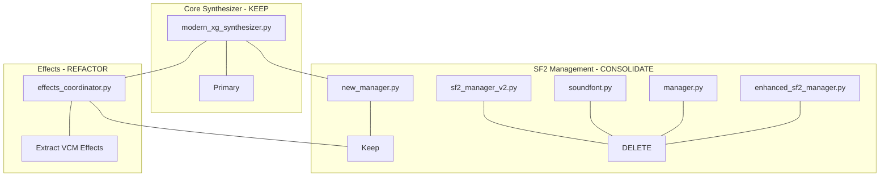

# Synth Package Analysis - Obsolete and Duplicate Modules

## Executive Summary

After analyzing the `synth` package, I've identified **significant code duplication** across multiple modules, particularly in:

1. **SF2 Management** - 7+ overlapping implementations
2. **Synthesizer Classes** - 2 major synthesizer implementations with overlapping functionality
3. **Effects Processing** - Multiple effect processor variants

---

## 1. SF2 Module Duplication Analysis

### Duplicate Manager Implementations (7 files)

| File | Status | Purpose |
|------|--------|---------|
| [`synth/sf2/core/manager.py`](synth/sf2/core/manager.py) | ⚠️ Likely Obsolete | Original SF2 manager |
| [`synth/sf2/core/new_manager.py`](synth/sf2/core/new_manager.py) | ✅ Active | Complete redesign with lazy loading (885 lines) |
| [`synth/sf2/core/sf2_manager_v2.py`](synth/sf2/core/sf2_manager_v2.py) | ❌ Duplicate | Simplified redesign - **exact duplicate of new_manager.py** (727 lines) |
| [`synth/sf2/core/soundfont_manager.py`](synth/sf2/core/soundfont_manager.py) | ⚠️ Overlapping | Modular design with caching (485 lines) |
| [`synth/sf2/core/soundfont.py`](synth/sf2/core/soundfont.py) | ❌ Duplicate | SoundFont class - **likely absorbed into new_manager** |
| [`synth/sf2/manager.py`](synth/sf2/manager.py) | ❌ Duplicate | Top-level manager - **old implementation** |
| [`synth/sf2/enhanced_sf2_manager.py`](synth/sf2/enhanced_sf2_manager.py) | ❌ Duplicate | "Enhanced" manager - **old naming convention** |

### SF2 Data Model Classes (Duplicated)

The following data classes are duplicated across multiple files:
- `SF2Zone` - Defined in: `new_manager.py`, `sf2_manager_v2.py`, `soundfont_manager.py`
- `SF2Preset` - Defined in: `new_manager.py`, `sf2_manager_v2.py`, `soundfont_manager.py`
- `SF2Instrument` - Defined in: `new_manager.py`, `sf2_manager_v2.py`, `soundfont_manager.py`

### SF2 Caching Duplication

| File | Status |
|------|--------|
| [`synth/sf2/caching/parameter_cache.py`](synth/sf2/caching/parameter_cache.py) | ✅ Active |
| [`synth/sf2/caching/sample_cache.py`](synth/sf2/caching/sample_cache.py) | ✅ Active |
| [`synth/sf2/caching/structure_cache.py`](synth/sf2/caching/structure_cache.py) | ✅ Active |

**Note**: The caching module is well-designed and should be kept. However, `new_manager.py` and `sf2_manager_v2.py` implement their own internal caching (LRUCache class) instead of using the centralized caching module.

---

## 2. Synthesizer Duplication Analysis

### Duplicate Synthesizer Classes

| File | Status | Lines | Purpose |
|------|--------|-------|---------|
| [`synth/engine/modern_xg_synthesizer.py`](synth/engine/modern_xg_synthesizer.py) | ✅ **Primary** | 1969 | Main modern synthesizer with XG/GS/MPE support |
| [`synth/engine/optimized_xg_synthesizer.py`](synth/engine/optimized_xg_synthesizer.py) | ⚠️ Overlapping | 1352 | High-performance version with similar features |

### Overlap Analysis

Both synthesizers implement:
- ✅ XG specification compliance
- ✅ GS compatibility mode
- ✅ MPE support
- ✅ Jupiter-X integration
- ✅ Effects processing (XGEffectsCoordinator)
- ✅ SF2/SFZ engines
- ✅ Arpeggiator system
- ✅ Buffer management (XGBufferPool)

**Key Difference**: `optimized_xg_synthesizer.py` includes extensive performance logging and audio debugging features, but the core functionality is identical.

---

## 3. Effects Module Analysis

### Effect Processor Files

| File | Status | Notes |
|------|--------|-------|
| [`synth/effects/effects_coordinator.py`](synth/effects/effects_coordinator.py) | ✅ **Primary** | Main coordinator (1600 lines) |
| [`synth/effects/system_effects.py`](synth/effects/system_effects.py) | ✅ Active | System effects (reverb, chorus) |
| [`synth/effects/variation_effects.py`](synth/effects/variation_effects.py) | ✅ Active | Variation effects |
| [`synth/effects/insertion_pro.py`](synth/effects/insertion_pro.py) | ✅ Active | Production insertion effects |
| [`synth/effects/eq_processor.py`](synth/effects/eq_processor.py) | ✅ Active | Multi-band EQ |
| [`synth/effects/types.py`](synth/effects/types.py) | ✅ Active | Effect type definitions |

### VCM Effects (Embedded in Coordinator)

The [`effects_coordinator.py`](synth/effects/effects_coordinator.py) contains embedded VCM effect implementations:
- `_process_vcm_overdrive()`
- `_process_vcm_distortion()`
- `_process_vcm_phaser()`
- `_process_vcm_equalizer()`
- `_process_vcm_stereo_enhancer()`

**Recommendation**: These should be extracted to separate modules for better organization.

---

## 4. Jupiter-X Module Analysis

### Files in `synth/jupiter_x/`

| File | Status | Notes |
|------|--------|-------|
| [`synth/jupiter_x/jupiter_x_engine.py`](synth/jupiter_x/jupiter_x_engine.py) | ✅ Active | Main Jupiter-X engine |
| [`synth/jupiter_x/unified_parameter_system.py`](synth/jupiter_x/unified_parameter_system.py) | ✅ Active | Parameter management |
| [`synth/jupiter_x/arpeggiator.py`](synth/jupiter_x/arpeggiator.py) | ⚠️ Check if used | May overlap with main arpeggiator |
| [`synth/jupiter_x/constants.py`](synth/jupiter_x/constants.py) | ✅ Active | Constants |
| [`synth/jupiter_x/component_manager.py`](synth/jupiter_x/component_manager.py) | ✅ Active | Component management |

### Potential Duplicates

| File | Concern |
|------|---------|
| [`synth/jupiter_x/arpeggiator.py`](synth/jupiter_x/arpeggiator.py) | May duplicate `synth/xg/xg_arpeggiator_engine.py` |
| [`synth/jupiter_x/midi_controller.py`](synth/jupiter_x/midi_controller.py) | May duplicate MIDI handling in main synthesizer |

---

## 5. XG Module Analysis

### XG Component Files

| File | Status | Notes |
|------|--------|-------|
| [`synth/xg/xg_arpeggiator_engine.py`](synth/xg/xg_arpeggiator_engine.py) | ✅ Active | Arpeggiator engine |
| [`synth/xg/xg_arpeggiator_manager.py`](synth/xg/xg_arpeggiator_manager.py) | ✅ Active | Multi-arpeggiator manager |
| [`synth/xg/xg_drum_kit_manager.py`](synth/xg/xg_drum_kit_manager.py) | ✅ Active | Drum kit management |
| [`synth/xg/xg_receive_channel_manager.py`](synth/xg/xg_receive_channel_manager.py) | ✅ Active | Channel routing |

### Potential Issues

- Multiple arpeggiator implementations across modules
- Some XG features may be duplicated in Jupiter-X module

---

## 6. Voice/Channel Module Analysis

### Channel-Related Files

| File | Status | Notes |
|------|--------|-------|
| [`synth/channel/channel.py`](synth/channel/channel.py) | ✅ Primary | Main channel class |
| [`synth/channel/channel_note.py`](synth/channel/channel_note.py) | ⚠️ Check usage | Note handling |
| [`synth/voice/voice.py`](synth/voice/voice.py) | ✅ Active | Voice class |
| [`synth/voice/voice_manager.py`](synth/voice/voice_manager.py) | ✅ Active | Voice management |
| [`synth/voice/voice_factory.py`](synth/voice/voice_factory.py) | ✅ Active | Voice factory |

---

## 7. Sequencer Module Analysis

### Files in `synth/sequencer/`

| File | Status | Notes |
|------|--------|-------|
| [`synth/sequencer/song_mode.py`](synth/sequencer/song_mode.py) | ✅ Active | Song playback |
| [`synth/sequencer/midi_file_handler.py`](synth/sequencer/midi_file_handler.py) | ✅ Active | MIDI file handling |
| [`synth/sequencer/groove_quantizer.py`](synth/sequencer/groove_quantizer.py) | ✅ Active | Groove quantization |
| [`synth/sequencer/pattern_sequencer.py`](synth/sequencer/pattern_sequencer.py) | ✅ Active | Pattern sequencing |
| [`synth/sequencer/recording_engine.py`](synth/sequencer/recording_engine.py) | ⚠️ Check usage | May be incomplete |

---

## 8. Obsolete Files Identified

### Files Recommended for Removal

1. **`synth/sf2/core/sf2_manager_v2.py`** - Exact duplicate of `new_manager.py`
2. **`synth/sf2/core/soundfont.py`** - Absorbed into new manager
3. **`synth/sf2/manager.py`** - Old top-level manager
4. **`synth/sf2/enhanced_sf2_manager.py`** - Old naming convention

### Files Recommended for Refactoring

1. **`synth/engine/optimized_xg_synthesizer.py`** - Merge performance features into `modern_xg_synthesizer.py`
2. **`synth/effects/effects_coordinator.py`** - Extract VCM effects to separate modules
3. **`synth/jupiter_x/arpeggiator.py`** - Consolidate with main arpeggiator

---

## 9. Recommended Architecture

---

## 10. Action Items

### High Priority
1. [ ] Delete `synth/sf2/core/sf2_manager_v2.py` (exact duplicate)
2. [ ] Delete `synth/sf2/core/soundfont.py` (absorbed)
3. [ ] Delete `synth/sf2/manager.py` (old implementation)
4. [ ] Delete `synth/sf2/enhanced_sf2_manager.py` (old naming)

### Medium Priority
5. [ ] Merge performance logging from `optimized_xg_synthesizer.py` into `modern_xg_synthesizer.py`
6. [ ] Extract VCM effects from `effects_coordinator.py` to separate modules
7. [ ] Consolidate arpeggiator implementations

### Low Priority
8. [ ] Review Jupiter-X integration for duplication
9. [ ] Audit XG module for overlapping functionality
10. [ ] Document the remaining architecture

---

## Files to Remove (Summary)

| Path | Reason |
|------|--------|
| `synth/sf2/core/sf2_manager_v2.py` | Duplicate of `new_manager.py` |
| `synth/sf2/core/soundfont.py` | Absorbed into new manager |
| `synth/sf2/manager.py` | Old implementation |
| `synth/sf2/enhanced_sf2_manager.py` | Redundant |

**Estimated code reduction**: ~2,000+ lines of duplicate code
